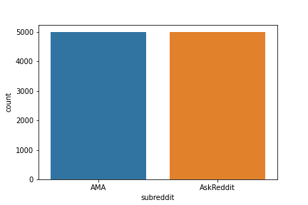
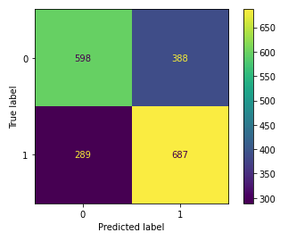
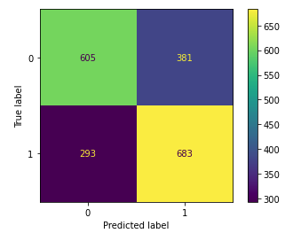
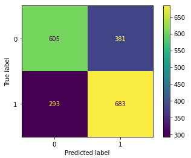
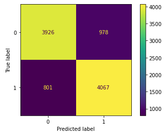
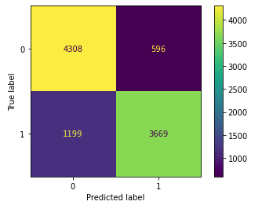
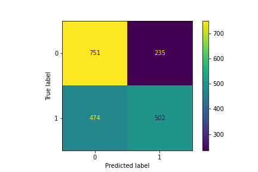

# Project 3
# *Web APIs & NLP - AKA the Reddit Project*

## Contents
 - [Problem Statement](#Problem-Statement)
 - [Executive Summary](#Executive-Summary)
 - [File Directory](#File-Directory)
 - [Data](#Data)
 - [Data Dictionary](#Data-Dictionary)
 - [Conclusions and Recommendations](#Conclusions-and-Recommendations)
 - [Areas for Further Research/Study](#Areas-for-Further-Research/Study)
 - [Sources](#Sources)
 - [Visualizations](#Visualizations)

## Problem Statement
[back to top](#Project-3)

Pull text from two similar subreddits, and compare the two sets using Supervised Machine Learning to see whether we can teach a Bayesian model and another model to decipher where the entry came from. Then compare the results from each model to see which model does better. The two subreddits chosen are the "AMA" subreddit and the "AskReddit" subreddit.

## Executive Summary
[back to top](#Project-3)

Can Supervised Machine Learning tell us where a subreddit comment comes from? I compare posts from two similar subreddits to see whether we can teach a Bayesian model and another model to decipher where the entry came from. I then compared the results from each model to see which model does better. The two subreddits chosen are the "AMA" subreddit and the "AskReddit" subreddit.

During my Exploratory Data Analysis and cleaning of the Data I found much of the superfluous data pulled from the Pushshift.io API from these two subreddits was not there, which is fine since I was mostly insterested in the comments themselves.

In my process I explored many different models, and variations of Techniques. Two distinct and necessary techniques, Count Vectorization and TFIDF Vectorization were used. These two vectorization proved valuable in the process to help put a value to text by looking at the frequency used, and assessing from which subreddit the text likely came from.

Models that I tried included Naive Bayes, Logistic Regression, Random Forest, Decision Tree, Bagging, Gradient Boosting, and Ada Boosting. First, I tried applying these models to the contents of each comment. I then tried applying these to the rest of the data, but the results from the first process could not be outdone. I also explored the Voting Classifier, but it did not seem to improve much, and any improvement was imbalanced.

The Metrics I focused on was mainly F1 score, but also Accuracy and Recall. I tried to keep an eye on the ratio of True/False Positives/Negatives. Confusion Matrices proved helpful for the latter. Since this is a Binary Classification problem with no real "negative" or "Positive" I wanted a Model that was well balanced in Precision __*and*__ Accuracy.

It comes as no surprise that I found this difficult to achieve since this is often the case with such matters. While my Bayesian Model did ok, I think my Logistic Regression model performed best in terms of balance. Since this we are only  trying to predict which subreddit a comment came from, I think we would prefer balance with a model. 

## File Directory
[back to top](#Project-3)
### *Files should be clearly labeled with descriptive names*
03-Project 
| 
|__ code 
|&nbsp;&nbsp;&nbsp;&nbsp;|__ 00_table_of_contents.ipynb  
|&nbsp;&nbsp;&nbsp;&nbsp;|__ 01_webscraper.ipynb  
|&nbsp;&nbsp;&nbsp;&nbsp;|__ 02_eda_and_cleaning.ipynb  
|&nbsp;&nbsp;&nbsp;&nbsp;|__ 03_basic_models.ipynb  
|&nbsp;&nbsp;&nbsp;&nbsp;|__ 04_models_with_gridsearch.ipynb  
|&nbsp;&nbsp;&nbsp;&nbsp;|__ 05_models_without_body.ipynb  
|&nbsp;&nbsp;&nbsp;&nbsp;|__ 06_voting_models.ipynb  
|&nbsp;&nbsp;&nbsp;&nbsp;|__ 07_lemmatized_bayes.ipynb  
|&nbsp;&nbsp;&nbsp;&nbsp;|__ 08_voting_revisited.ipynb  
|&nbsp;&nbsp;&nbsp;&nbsp;|__ 09_conclusion.ipynb  
|&nbsp;&nbsp;&nbsp;&nbsp;|__ functions.ipynb  
|&nbsp;&nbsp;&nbsp;&nbsp;|__ functions_stream_env.ipynb  
| 
|__ data  
|&nbsp;&nbsp;&nbsp;&nbsp;|__ 2021-04-27_1812_AMA_comments.csv  
|&nbsp;&nbsp;&nbsp;&nbsp;|__ 2021-04-27_1812_AskReddit_comments.csv  
|&nbsp;&nbsp;&nbsp;&nbsp;|__ 2021-05-03_1936_AMA_comments.csv  
|&nbsp;&nbsp;&nbsp;&nbsp;|__ 2021-05-03_1936_AskReddit_comments.csv  
|&nbsp;&nbsp;&nbsp;&nbsp;|__ 2021-05-03_2005_AMA_comments.csv  
|&nbsp;&nbsp;&nbsp;&nbsp;|__ 2021-05-03_2005_AskReddit_comments.csv  
|&nbsp;&nbsp;&nbsp;&nbsp;|__ ama_comments.csv  
|&nbsp;&nbsp;&nbsp;&nbsp;|__ ar_comments.csv  
|&nbsp;&nbsp;&nbsp;&nbsp;|__ clean_data.csv  
|&nbsp;&nbsp;&nbsp;&nbsp;|__ comments.csv  
|&nbsp;&nbsp;&nbsp;&nbsp;|__ submissions.csv  
| 
|__ images  
|&nbsp;&nbsp;&nbsp;&nbsp;|__ subreddit_count.png  
|&nbsp;&nbsp;&nbsp;&nbsp;|__ vote_ada_gbst_lgr_CM.png  
|&nbsp;&nbsp;&nbsp;&nbsp;|__ vote_rfc_lgr_tvect_CM.png  
|&nbsp;&nbsp;&nbsp;&nbsp;|__ vote_X_lgr_gsbayes_CM.png  
|&nbsp;&nbsp;&nbsp;&nbsp;|__ X_gs_tv_lgr_CM.png  
|&nbsp;&nbsp;&nbsp;&nbsp;|__ X_gs_tv_nb_CM.png  
| 
|__ presentation  
|&nbsp;&nbsp;&nbsp;&nbsp;|__ ChrisCaldarella_project3_presentation.pdf  
|&nbsp;&nbsp;&nbsp;&nbsp;|__ ChrisCaldarella_project3_presentation.pptx  
| 
|__ README.md  

## Data
[back to top](#Project-3)

I was able to pull my data from reddit using pushshift.io's reddit API. I engineered a feature that represented the number of characters in the comment which helped me identify some outliers.

I removed most features (noted in the Data Dictionary below), but besides the 'body' of the comment and 'subreddit' I kept the following features:
 - author_premium
 - is_submitter
 - no_follow
 - score
 - send_replies
 - total_awards_received

## Data Dictionary
[back to top](#Project-3)

| Feature                         | Python Type | Data Type  | DROP? | Descritpion   |
| ---                             | ---         | ---        | ---   |:---           |
| all_awardings                   | Object      | Continuous |   X   | All awards the post received (tags, images, etc.) |
| associated_award                | float64     | Continuous |   X   | Not sure - all were populated with '[]' |
| author                          | Object      | Continuous |   X   | Reddit-Handle of the auther of the comment |
| author_flair_background_color   | float64     | Continuous |   X   | Flair background color - all were populated with '[]' |
| author_flair_css_class          | float64     | Continuous |   X   | Flair CSS class - all were populated with '[]' |
| author_flair_richtext           | Object      | Continuous |   X   | Flair richtext - all were populated with '[]' |
| author_flair_template_id        | float64     | Continuous |   X   | Flair template ID - all were populated with '[]' |
| author_flair_text               | float64     | Nominal    |   X   | Flair text - all were populated with '[]' |
| author_flair_text_color         | Object      | Nominal    |   X   | Flair text color - almost all were populated with '[]' |
| author_flair_type               | Object      | Nominal    |   X   | Flair type - almost all are 'text' |
| author_fullname                 | Object      | Continuous |   X   | Full author-id of the author of the comment |
| author_patreon_flair            | Boolean     | Ordinal    |   X   | Whether author's has Patreon Flair almost all were 'False' |
| author_premium                  | Boolean     | Continuous |       | Denotes whether author is a premium user |
| awarders                        | Object      | Continuous |   X   | Not sure - all were populated with '[]' |
| __body__                        | Object      | Continuous |       | Text part we will be evaluating (X-value) |
| collapsed_because_crowd_control | int64       | Continuous |   X   | Not sure - all were populated with '[]' |
| comment_type                    | int64       | Continuous |   X   | Not sure - all were populated with 'NaN' |
| created_utc                     | Object      | Continuous |   X   | When the comment was created |
| gildings                        | Object      | Continuous |   X   | Gildings teh author of the post has/recieved |
| id                              | Object      | Continuous |   X   | Comment ID (in relation to other comments) |
| is_submitter                    | Boolean     | Continuous |       | Seems to denote whether the commenter authored the parent post  |
| link_id                         | Object      | Continuous |   X   | ID which part of is used in the permalink |
| locked                          | Boolean     | Continuous |   X   | Denotes whether the thread (which the comment is part of) has been locked |
| no_follow                       | Boolean     | Continuous |       | Seems to denote whether the author of the post can be followed on reddit |
| parent_id                       | Object      | Continuous |   X   | ID of the parent comment (in relation to the current comment) Dropping because it may make guessing too easy. |
| permalink                       | Object      | Continuous |   X   | URL to post - must drop because this contains the subreddit name |
| retrieved_on                    | Object      | Continuous |   X   | When comment was retrieved through the pushshift.io API - dropping because it should not be relevant |
| score                           | int64       | Continuous |       | 'Score' (or Karma) of the comment |
| send_replies                    | Boolean     | Continuous |       | Seems to denote whether author of comment accepts replies |
| stickied                        | Boolean     | Continuous |   X   | Denotes 'Sticky posts' - Sticky posts are announcements and are not posts |
| __subreddit__                   | Object      | Continuous |   X   | y-value - the subreddit we want to predict, __must drop__ |
| subreddit_id                    | Object      | Continuous |   X   | ID representation of the subreddit, __must drop__ |
| top_awarded_type                | Object      | Continuous |   X   | Not sure - all were populated with 'NaN' |
| total_awards_received           | int64       | Continuous |       | Number of awards received by the author of the comment |
| treatment_tags                  | Object      | Continuous |   X   | Not sure - all were populated with '[]' |
| distinguished                   | Object      | Continuous |   X   | Denotes whether the author of the post is a 'moderator' |
| author_cakeday                  | Boolean     | Continuous |   X   | Boolean whether it is the 'cakeday' of the author of the comment (cakeday is the anniversary of the day the user originally signed up for reddit.) |

## Conclusions and Recommendations
[back to top](#Project-3)

The Metrics I focused on was mainly F1 score, but also Accuracy and Recall. I tried to keep an eye on the ratio of True/False Positives/Negatives. Confusion Matrices proved helpful for the latter. Since this is a Binary Classification problem with no real "Negative" or "Positive" I wanted a Model that was well balanced in Precision __*and*__ Accuracy.

Since this we are only  trying to predict which subreddit a comment came from, I think we would prefer balance with a model. We are not predicting a cancer diagnosis (where we would want to less False Negatives and would allow more False Postives to do achieve this), and this is not something where we need to determine any sort of risk, like lending money for a loan. These are two equally weighted classifications, so I tried to achieve the most balanced results, but with some give if the Model predicted better; there is always going tobe bias.

It is worth noting that Lemmatizing the Naive Bayes model did not yield the results I was hoping for - it made the bias worse and took away any speed that teh Bayes model typically gives.

While my Bayesian Model did ok, I think my Logistic Regression model performed best in terms of balance. And Logistic Regression did well with it's F1 score too (71.16%), but other models came close, such as the Ada Boost and the Random Forest Classifications. I would recommend the Logistic Regression with TF-IDF Vectorization to make predictions between these two subreddits.

## Areas for Further Research/Study
[back to top](#Project-3)

To further research into this topic, I think it would worthwhile to study generating probability of other features, and caluclating a prediction to see if there is any sway. Like I often found, it becomes difficult to find results that are not biased. And maybe it would be worth some time to re-introduce some Data that had since been disregarded.

Extending upon that I think it might be useful to apply ways to combine the results of the Data compiled using Sparse Matrices with data that was compiled without them. And perhaps introducing Neural Networks.

## Sources
[back to top](#Project-3)
[https://pushshift.io/api-parameters/](https://pushshift.io/api-parameters/)
[https://api.pushshift.io/](https://api.pushshift.io/)
[https://elastic.pushshift.io/](https://elastic.pushshift.io/)
[https://api.pushshift.io/reddit/search/comment/](https://api.pushshift.io/reddit/search/comment/)

## Visualizations
[back to top](#Project-3)
- *Any important visualizations*
- *These can be included in the Executive Summary or Conclusions/Recommendations, or as its own section.*
- *Use good judgement! Include a few here that really highlight your findings.*

### Null Model

### Voting Classifier, Confusion Matrix:
 - TF-IDF Vectorizer applied to Data
 - Random Forest Classifier
 - Logistic Regression

### Voting Classifier, Confusion Matrix:
#### GridSearch objects: 
 - Ada Boosting (with Count Vectorizer)
 - Gradient Boosting (with TF-IDF Vectorizer)
 - Logistic Regression (with TF-IDF Vectorizer)

### Voting Classifier, Confusion Matrix:
#### GridSearch objects: 
 - Logistic Regression (with TF-IDF Vectorizer)
 - Multinomial Naive Bayes (with TF-IDF Vectorizer)

### Logistic Regression, Confusion Matrix:
#### GridSearch objects (with TF-IDF Vectorizer)

### Multinomial Naive Bayes, Confusion Matrix:
#### GridSearch objects (with TF-IDF Vectorizer)

### Multinomial Naive Bayes, Confusion Matrix:
#### TF-IDF Vectorizer applied to Data (with Lemmatization)

